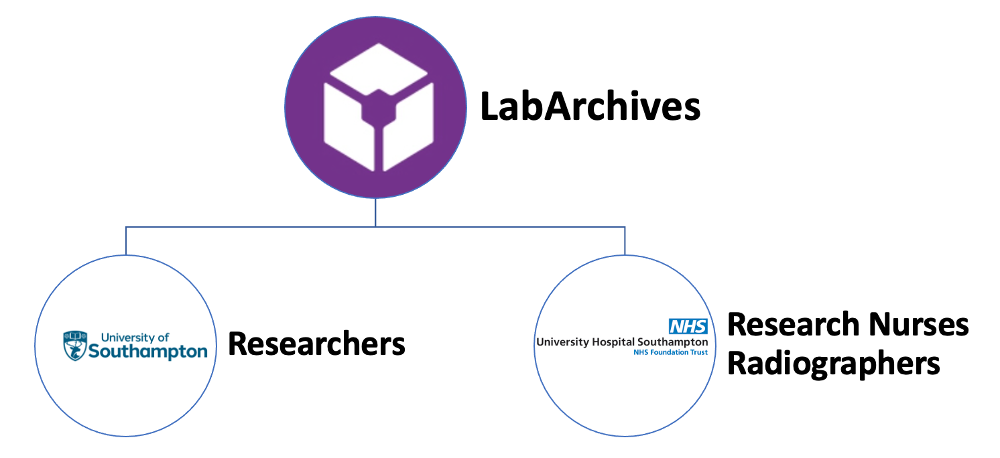
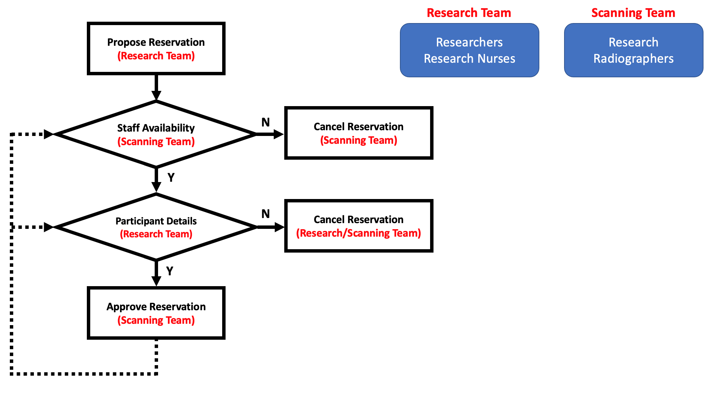
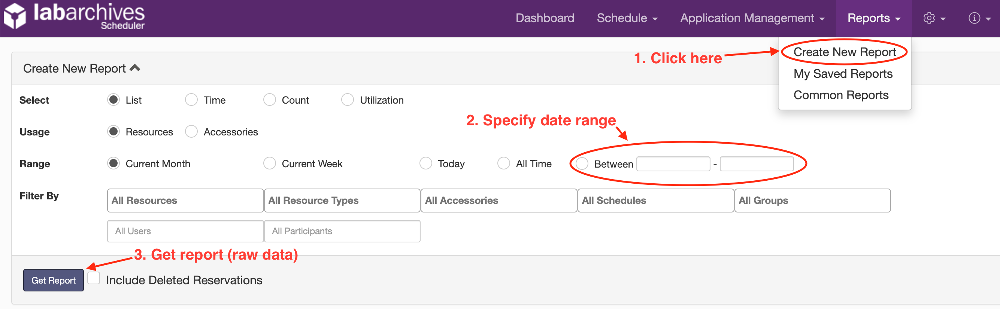
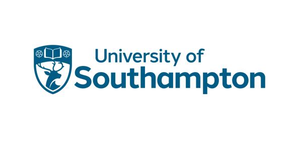
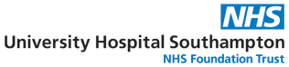

Table of Contents
=================
 * [Overview](#overview)
 * [Workflow and Expected Logistics](#logistics)
 * [Quickstart](#How-to)
     1. [Get Report](#How-to-1-get-report)
 * [Acknowledgments](#acknowledgments)
 

## Overview

Brief description for the interactive app goes here.

This app was developed and maintained by [Dr Yukai Zou](https://www.southampton.ac.uk/cndng/about/yukai-zou.page).

## Workflow and Expected Logistics

Expected logistics are:

1. Constantly maintained calendar with most up-to-date availability
2. Minimal information
   - Title: De-identified participant ID (e.g. NENAH001, ROAR001)
   - Description: Hospital ID (e.g. Rhm1234567), participant initials (optional)
   - No PHI/PII. No participant full name, parent’s full name, DOB, etc.
   - Type of scan: University Research, etc. (for report and auditing purposes, see demo)
3. All new reservations pending approval
4. Unused slots are released immediately so other studies may use
   - Scanning team reserves the right to remove slots that participant details are not provided timely
   - **Communicate closely between research/scanning team**
5. (For rescheduling) In principle, research team proposes new reservation
   - Research team shall deletes the existing one and make a new reservation
   - Research team shall shall not update the approved reservation to a new date
   - **But scanning team could help. Communicate closely between scanning/research team**

## Quickstart

### 1. Get Report

You should already obtain an account and have access to the research MRI booking system. Instructions for how to do so can be accessed [here](https://sotnir-handbook.readthedocs.io/en/latest/projects-soton/mri-scanner.html).

Link: https://scheduler.labarchives.com/

## Acknowledgments

