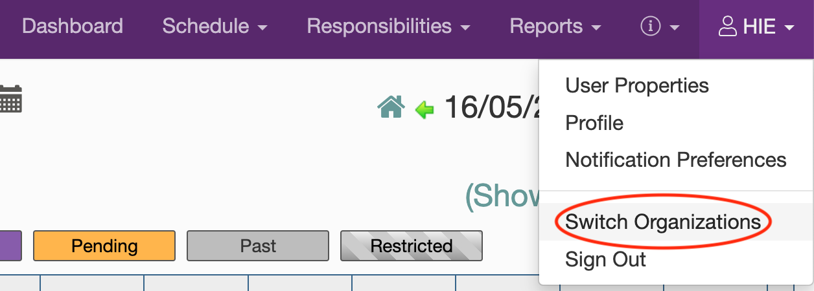

Table of Contents
=================
 * [Overview](#overview)
 * [Quickstart](#How-to)
     1. [Sign In](#How-to-1-sign-in)
     2. [Get Report](#How-to-2-get-report)
 * [Workflow and Expected Logistics](#logistics)
 * [Acknowledgments](#acknowledgments)
 

## Overview

This interactive app serves as a tool to track and quantify the utility of university research slots on the 3T MRI, through creating diagrams based on the report from [LabArchives](https://sotnir-handbook.readthedocs.io/en/latest/projects-soton/mri-scanner.html).

This app was developed and maintained by Dr Yukai Zou (Y.Zou@soton.ac.uk).

## Quickstart

### 1. Sign In

You should already obtain an account and have access to the research MRI booking system:

 - Link: https://scheduler.labarchives.com/

Instructions for how to create an account can be accessed [here](https://sotnir-handbook.readthedocs.io/en/latest/projects-soton/mri-scanner.html).

After signing in you may or may not view the calendar of research MRI slots immediately. If not, you will need to click on your name at the top right and select "Switch Organizations": 

This will open up a window where you can choose which organization to view. Select “Southampton Research MRI”, and you should be able to view the calendar.

### 2. Get Report

To create new report, follow the steps below:

## Workflow and Expected Logistics

Expected logistics are:

1. Constantly maintained calendar with most up-to-date availability
2. Minimal information
   - Title: De-identified participant ID (e.g. NENAH001, ROAR001)
   - Description: Participant initials (optional)
   - To avoid confidentiality breach, DO NOT put any protected health information (PHI) or patient identifiable information (PII). No participant full name, parent’s full name, Hospital ID, Date of Birth, Home Address, Contact information etc.
   - Type of scan: University Research, etc. (for report and auditing purposes, see demo)
3. All new reservations pending approval
4. Unused slots are released immediately so other studies may use
   - Scanning team reserves the right to remove slots that participant details are not provided timely
   - **Communicate closely between research/scanning team**

## Acknowledgments

